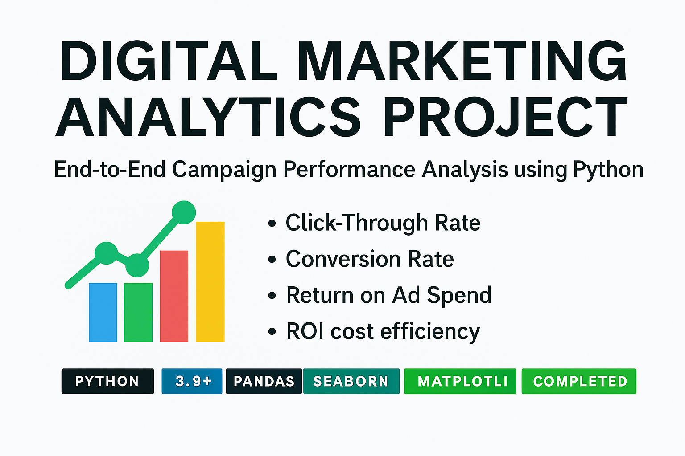

<h1 align="center">📊 Digital Marketing Analytics Project</h1>
<h3 align="center">End-to-End Campaign Performance Analysis using Python</h3>
<h4 align="center">By Jaswanth Reddy Lanka — MSBA | Data Analyst</h4>

> **This project showcases my end-to-end analytical capabilities**, covering the full pipeline from data cleaning & feature engineering to insight generation, visualization, and business interpretation.

I analyzed **115,000+ digital ad performance records** to understand how banner sizes, placements, engagement levels, and campaign strategies influence:
- Click-through behavior  
- Conversion patterns  
- Post-click revenue  
- ROI and cost efficiency  


<p align="center">
  
</p>


This project showcases my end-to-end analytical capabilities as a Data Analyst, covering everything from data cleaning and feature engineering to insight generation and data storytelling.

I analyzed **15,000+ digital advertising records** to uncover how banner sizes, placements, engagement levels, and campaign decisions impact revenue, conversions, and ROI.

The repository includes my full analysis code, business insights, and polished project report.


---

# ⭐ Why this is MUCH better

### ✔ Clean table layout  
Easy for recruiters to scan each file + description.

### ✔ Professional icons  
Used consistently to represent file types.

### ✔ Perfect spacing  
GitHub displays tables very cleanly.

### ✔ Optional folder structure  
Shows how well-organized your project is.

---

# 🔥 Want an even more aesthetic version?

### **Version B — Modern Card Layout**

```md
## 📁 Repository Contents

### 🧠 Code
- **Code_file.py**  
  Full Python analysis script with EDA, KPI metrics, trends, & visualizations.

### 📊 Data
- **online_advertising_performance_data.csv**  
  Dataset used for ad-performance analysis. *(Include only if permitted)*

### 📄 Reports
- **Digital_Marketing_Analytics_Report.docx**  
  Complete written analysis + graphs + business recommendations.

- **Problem Statement & Data Description.docx**  
  Original project brief & variable definitions.

### 📚 Documentation
- **README.md**  
  Portfolio showcase with insights, visuals, and project overview.

---

## 📁 Repository Contents

Here’s a quick overview of everything included in this project:

| File / Folder | Description |
|--------------|-------------|
| **Code_file.py** | 🧠 Full Python analysis script containing EDA, visualizations, and KPI computation |
| **online_advertising_performance_data.csv** | 📊 Dataset used for analysis *(add only if shareable)* |
| **Digital_Marketing_Analytics_Report.docx** | 📄 Full project report with insights, visuals, and recommendations |
| **Problem Statement & Data Description.docx** | 📘 Original project brief and dataset explanation |
| **README.md** | 📚 Portfolio showcase including project summary, findings & visual documentation |

---

## 🔥 Project Highlights

### ✅ **20+ Business Questions Answered**
Covering engagement trends, conversion efficiency, ROI, and behavioral patterns.

### 📊 **Complete EDA & KPI Development**
CTR, CVR, ROAS, RPC, CPC, engagement scores, rolling averages, statistical insights.

### 🎨 **Clear Visual Insights**
Line charts, bar charts, scatterplots, regression lines, distributions — all auto-generated.

### 💼 **Business-Focused Interpretation**
Insights written for executives, marketing teams, and analysts.


---

## 📁 Repository Contents
📂 Digital-Marketing-Analytics-Project
│
├── Code_file.py # Full Python analysis script
├── online_advertising_performance_data.csv # Dataset (if shareable)
├── Digital_Marketing_Analytics_Report.docx # Full report with visuals
├── Problem Statement & Data Description.docx # Original project brief
└── README.md # Portfolio showcase (this file)

---

## 🛠️ Tools & Technologies

- **Python** (Pandas, NumPy, Seaborn, Matplotlib)
- **Data Visualization**
- **Statistical Analysis & Correlations**
- **Rolling Time-Series Analysis**
- **ETL & Feature Engineering**
- **Marketing KPIs & ROI Analysis**

---

## 📈 Key Insights From the Project

### 🔹 Engagement Trend  
- Clear upward trend across the campaign with weekly cycles.

### 🔹 Best Performing Banner Sizes  
- **240×400, 300×250, 728×90** drove the highest clicks.

### 🔹 Top Publisher Placements  
- **GHI** and **MNO** outperformed others across clicks & display impressions.

### 🔹 Strong Cost–Revenue Relationship  
- Correlation: **0.76** → more spend = more revenue.

### 🔹 Conversion Rate Leaders  
- **Campaign 1** shows highest post-click conversion efficiency.

### 🔹 Seasonal & Weekly Patterns  
- Mid-week performance peaks, weekend dips.

### 🔹 Highest ROI Campaign  
- Campaign 1 dominated across revenue per click & ROAS efficiency.

---

## 🚀 How to Run This Project

### 1️⃣ Install Dependencies
```bash
pip install pandas numpy seaborn matplotlib

2️⃣ Run the Analysis Script
python : Code_file.py

3️⃣ View the Results
All graphs and metrics will display automatically.


---

## 👨‍💻 Author

**Jaswanth Reddy Lanka**  
MSBA Candidate | Data Analyst | BI & Data Science Enthusiast  

📌 **LinkedIn:** https://www.linkedin.com/in/jaswanth-reddy-lanka  
📧 **Email:** jaswanthreddylanka@gmail.com  

**Skills:** Python • SQL • Tableau • Power BI • Excel • Machine Learning • Marketing Analytics  


